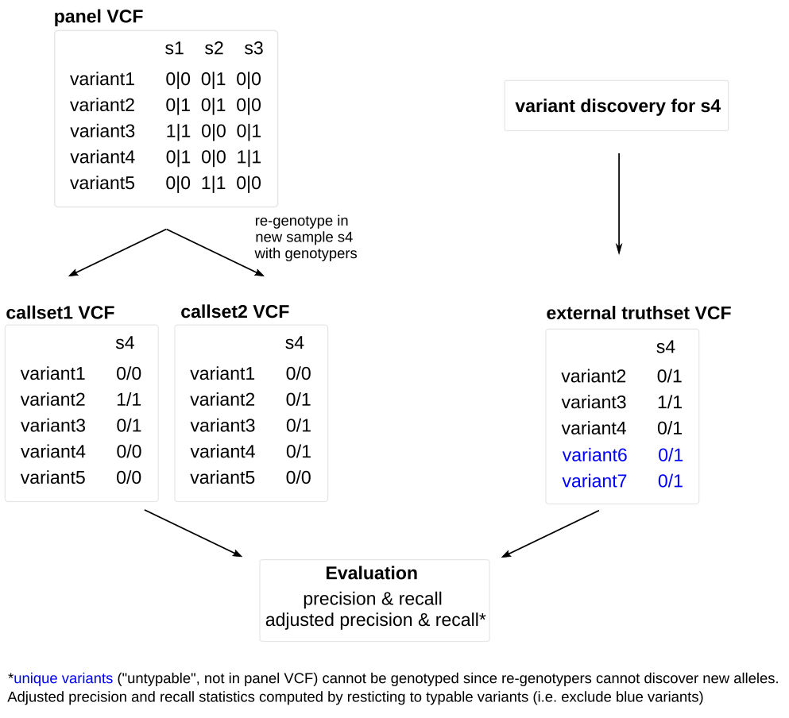

# Evaluate re-genotyping results with external callsets

This pipeline can be used to evaluate re-genotyping results with an external callset using vcfeval (for SNPs and indels) and truvari (for SVs).


## Why/when this pipeline is useful




In a scenario where variants are discovered in a set of samples and then **re-genotyped** in a new sample (i.e. a sample not part of the discovery set), variants that are unique to that new sample will be missed, since re-genotyping tools typically only genotype the input variants and cannot discover new alleles. Therefore, if one wants to evaluate the set of genotypes for the new sample using an external callset resulting from variant calling on the same sample, one needs to take into account that the external callset contains variants that will not be captured by the re-genotyper (since they were not in the input set used for genotyping). This pipeline accounts for this by computing "adjusted" precision and recall values by determining variants that are unique to the genotyped sample (and thus untypable) and excludes them from precision/recall calculations.


## How to run

First, insert paths to all required input files in the `` config/config.yaml `` file:


``` bat

# path to reference genome fasta + fai
reference: "path/to/reference.fa"
reference_fai: "path/to/reference.fa.fai"

# path to uncompressed biallelic panel vcf used as input to re-genotyper
# used to produce results provided in "callsets" section below
panel_vcf: "path/to/panel.vcf"

# lists infos and files for each truthset.
truthsets:
 <truthsetname>: # name of the truthset
  path: "/path/to/truth.vcf.gz" # path to truth set vcf
  callable_regions: "/path/to/callable-regions.bed" # path to BED with callable regions
  vartype: "sv" # variant type. Must be either "snp-indel" or "sv"
  callsets: # re-genotyped vcfs to compare against this truthset
   <callsetname1>: "/path/to/callset1.vcf.gz"
   <callsetname2>: "/path/to/callset2.vcf.gz"

# regions to evaluate in addition to all callable regions 
# in addition to evaluating all callable regions, this provides the option
# to look at subsets of callable regions.
# You can use your own regions by providing the respective BEDs. If none, set ot {}.
regions_to_bed:
 <regionname>: "path/to/region.bed"

```

The `` panel_vcf `` corresponds to the set of variants provided to the re-genotypers. The pipeline assumes that the callsets listed later in the `` callsets `` section contain the same set of variants, genotyped across the sample to be evaluated. For each truthset to be used as ground truth for evaluation, provide the path to the corresponding vcf (``path``), the callable regions (``callable_regions``), the type of variants it contains (``vartype``, either SNPs+indels or SVs) and a list of vcfs (``callsets``), each containing the same set of variants as the ``panel_vcf`` but re-genotyped in the sample to be evaluated. Several such vcfs can be listed in case different genotyping tools were run on the same set of input variants.

Then, run snakemake using this command: `` snakemake --use-conda -j <number_of_cores> ``

## Remarks

Note that the truthsets need to either contains SNPs+indels or SVs. These two variant types need to be evaluated separately (because the pipeline uses different tools to analyze them). So in case you have a ground truth set containing all variant types, you'd have to run the evaluation twice, once for small variants (SNPs+indels) and another time for SVs.


## Results

The results of the pipeline are precision/recall statistics as well as VCF files containing true positives, false positives, false negatives. Results will be written to: 
`` results/callset-comparisons/<truthset>/<vcfeval|truvari>_<callset>_<snp-indel|sv>_<all|typable>_region-<region>/ `` and precision and recall statistics can be found in a file called `` summary.txt `` in each of these folders.

For SNP+indels callsets, vcfeval results will be procuded, for SV callsets, truvari results will be computed. Two versions of precision and recall will be computed: `` all `` corresponds to regular precision and recall statistics including all variants, `` typable `` will exclude all untypable variants (see above) from the truth set prior to evaluation, since these variants cannot be genotyped by a re-genotyper and would thus always be counted as false negatives.
